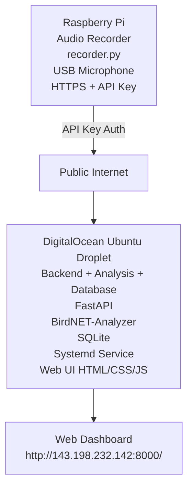

# BirdWatch

A full-stack, production-deployed bird detection system that continuously records backyard audio using a Raspberry Pi and performs cloud-based species identification using BirdNET. The system includes a web dashboard, automated deployment via CI/CD, and runs on a single DigitalOcean Ubuntu server.

---

## Architecture

---

## Live Deployment

The application is deployed on a single **DigitalOcean Ubuntu server**.

**Web Interface:**

http://143.198.232.142:8000/

The Raspberry Pi records audio locally and uploads detected clips to the server via a secure API key.

---

## CI/CD Pipeline

This project uses **GitHub Actions** for automated deployment.

On every push to the `main` branch:

- The Raspberry Pi runner:
  - Pulls latest code
  - Restarts the recorder service
- The DigitalOcean server:
  - Pulls latest backend changes
  - Restarts the FastAPI service

Deployment is fully automated using:
- Self-hosted GitHub Actions runner (on the Pi)
- SSH-based deployment to DigitalOcean

No manual deployment steps are required.

---

## Tech Stack

### Raspberry Pi
- Python 3
- sounddevice
- requests
- numpy
- Systemd service
- Self-hosted GitHub Actions runner

### Cloud Server (DigitalOcean Ubuntu)
- FastAPI
- Uvicorn
- BirdNET-Analyzer (Cornell Lab)
- SQLite
- aiofiles
- Systemd service

### Frontend
- Vanilla HTML
- CSS
- JavaScript
- No frameworks
- No build step

### DevOps
- GitHub Actions CI/CD
- Systemd service management
- Public API authentication
- Ubuntu production deployment

---

## Project Structure

├── pi/
│   ├── recorder.py
│   ├── config.py
│   └── requirements.txt
│
├── server/
│   ├── main.py
│   ├── analyzer.py
│   ├── database.py
│   ├── config.py
│   ├── uploads/
│   ├── static/
│   └── requirements.txt
│
├── web/
│   ├── index.html
│   ├── style.css
│   └── app.js
│
├── .github/workflows/
│   └── deploy.yml
│
├── .gitignore
└── README.md

---

## Setup Overview

### Environment Variables

**Raspberry Pi:**

DESKTOP_SERVER_URL=http://143.198.232.142:8000

API_KEY=your_secure_key
LAT=optional
LON=optional

The server uses its own `.env` configuration.

---

## Running the System

### Cloud Server

cd server
pip install -r requirements.txt
uvicorn main:app --host 0.0.0.0 --port 8000

In production, the server runs as a systemd service.

---

### Raspberry Pi

cd pi
pip install -r requirements.txt
python recorder.py

In production, the recorder runs as a systemd service and deploys automatically via GitHub Actions.

---

## Features

- Continuous audio monitoring
- Automated bird species identification using BirdNET
- Persistent SQLite storage
- Mobile-friendly web dashboard
- Audio playback in browser
- Species statistics and summaries
- Fully automated CI/CD deployment
- Production cloud hosting

---

## Troubleshooting

- **No detections:** Verify Pi can reach server and API key is correct.
- **Upload failures:** Confirm `DESKTOP_SERVER_URL` and firewall settings.
- **BirdNET errors:** Ensure dependencies are installed on the server.
- **Service not running:** Check `systemctl status birdwatch`.

---

## License

Uses BirdNET-Analyzer from the Cornell Lab of Ornithology.
