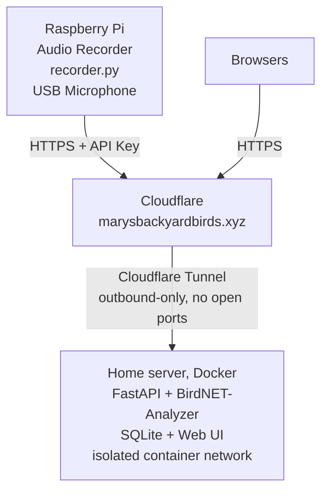

# BirdWatch

A full-stack bird detection system that continuously records backyard audio using a Raspberry Pi and identifies species with BirdNET. The server and web dashboard run in Docker on a home server, published to the internet only through a Cloudflare Tunnel.

---

## Architecture


```mermaid
graph TD
    A[Raspberry Pi<br/>Audio Recorder<br/>recorder.py<br/>USB Microphone] -->|HTTPS + API Key| B[Cloudflare<br/>marysbackyardbirds.xyz]
    B -->|Cloudflare Tunnel<br/>outbound-only, no open ports| C[Home server, Docker<br/>FastAPI + BirdNET-Analyzer<br/>SQLite + Web UI<br/>isolated container network]
    D[Browsers] -->|HTTPS| B
```

---

## Live Deployment

**Web Interface:** https://marysbackyardbirds.xyz/

The app runs as a Docker container on a home server ("homelab"). Visitors and the
Pi reach it through Cloudflare, which forwards requests over an outbound-only
Cloudflare Tunnel. No router ports are open, and the home IP isn't exposed. The
container is locked down and firewalled off from everything else on the home
network (see CLAUDE.md "Hosting"). It moved here from a DigitalOcean droplet in
October 2026.

The Raspberry Pi records audio locally and uploads detected clips to the server via a secure API key.

---

## Deployment

- **Raspberry Pi**: GitHub Actions. On every push to `main`, a self-hosted runner on
  the Pi pulls the latest code and restarts the recorder service.
- **Server (homelab)**: by hand, when there's a code change:

  ```bash
  cd ~/apps/birdingwatch && scripts/deploy-homelab.sh
  ```

  This pulls `main`, rebuilds the image, restarts the container, waits for the
  healthcheck and checks the public URL. The homelab isn't reachable from GitHub
  and runs no Actions runner, by design.

---

## Tech Stack

### Raspberry Pi
- Python 3
- sounddevice
- requests
- numpy
- Systemd service
- Self-hosted GitHub Actions runner

### Server (homelab, Docker)
- FastAPI
- Uvicorn
- BirdNET-Analyzer (Cornell Lab) via birdnetlib + TensorFlow
- SQLite
- aiofiles
- Docker Compose, Cloudflare Tunnel (cloudflared)

### Frontend
- Vanilla HTML
- CSS
- JavaScript
- No frameworks
- No build step

### DevOps
- GitHub Actions (Pi deploys)
- Docker with a hardened, firewall-isolated container
- Cloudflare Tunnel + Cloudflare DNS/TLS
- API key authentication for uploads

---

## Project Structure

```
pi/
├── recorder.py
├── config.py
└── requirements.txt

server/
├── main.py
├── analyzer.py
├── database.py
├── config.py
├── uploads/
├── static/
└── requirements.txt

web/
├── index.html
├── style.css
└── app.js

scripts/
├── deploy-homelab.sh            # manual server deploy
├── birdingwatch-firewall.sh     # host firewall isolation for the container network
└── birdingwatch-firewall.service

.github/workflows/
└── deploy.yml                   # Pi deploy only

Dockerfile
docker-compose.yml               # app + cloudflared, no host ports
.gitignore
README.md
```


---

## Setup Overview

### Environment Variables

**Raspberry Pi:**


DESKTOP_SERVER_URL=https://marysbackyardbirds.xyz

API_KEY=your_secure_key
LAT=optional
LON=optional


The server uses its own `.env` configuration (see `.env.example`).

---

## Running the System

### Server (homelab, Docker)

```bash
# .env (server config, chmod 600) and data/ (birdwatch.db + uploads/) at the repo root
docker compose up -d --build
```

The tunnel config and credentials live in `cloudflared/` (gitignored). For local
development without Docker, see CLAUDE.md "Local dev".

---

### Raspberry Pi


cd pi
pip install -r requirements.txt
python recorder.py


In production, the recorder runs as a systemd service and deploys automatically via GitHub Actions.

---

## Features

- Continuous audio monitoring
- Automated bird species identification using BirdNET
- Persistent SQLite storage
- Mobile-friendly web dashboard
- Audio playback in browser
- Species statistics and summaries
- Automated Pi deployment, one-command server deploys
- Self-hosted, publicly reachable through Cloudflare Tunnel with no open ports

---

## Troubleshooting

- **No detections:** Verify Pi can reach server and API key is correct.
- **Upload failures:** Confirm `DESKTOP_SERVER_URL` and check the Pi's log (`journalctl -u birdwatch-recorder`). Clips queue on the Pi and retry automatically.
- **Site down:** `docker compose ps` and `docker logs birdingwatch` / `docker logs birdingwatch-cloudflared` on the homelab.
- **BirdNET errors:** Rebuild the image (`scripts/deploy-homelab.sh`); versions are pinned in `server/requirements.lock.txt`.

---

## License

Uses BirdNET-Analyzer from the Cornell Lab of Ornithology.
